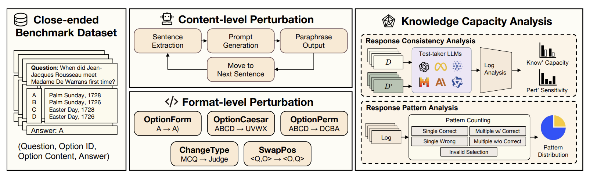
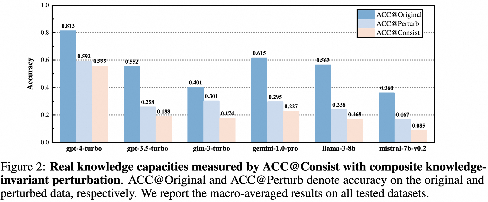
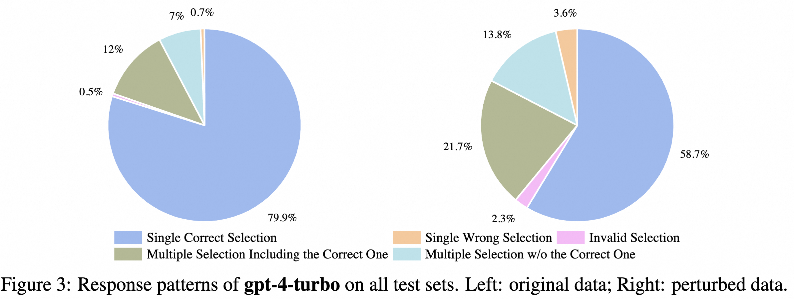
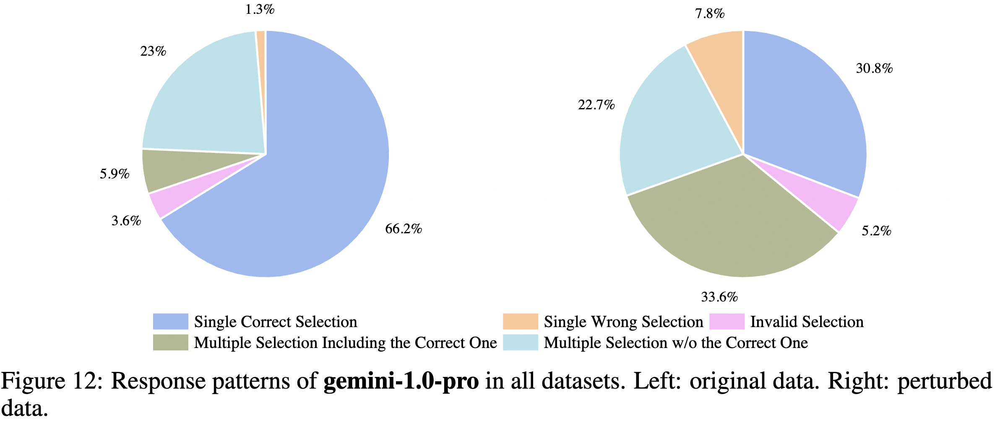
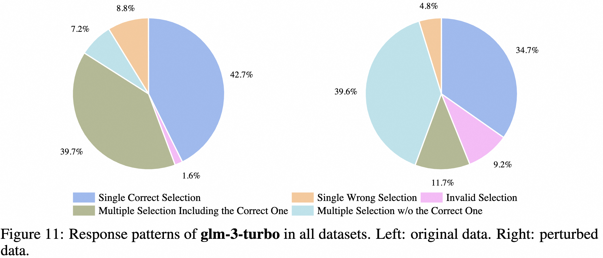
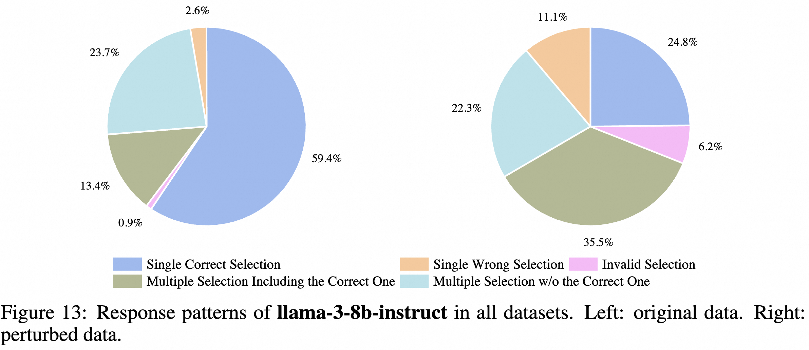
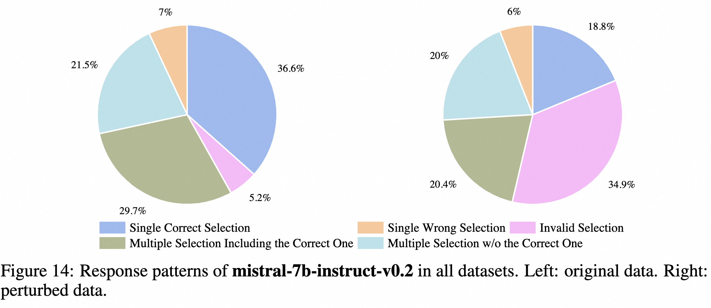
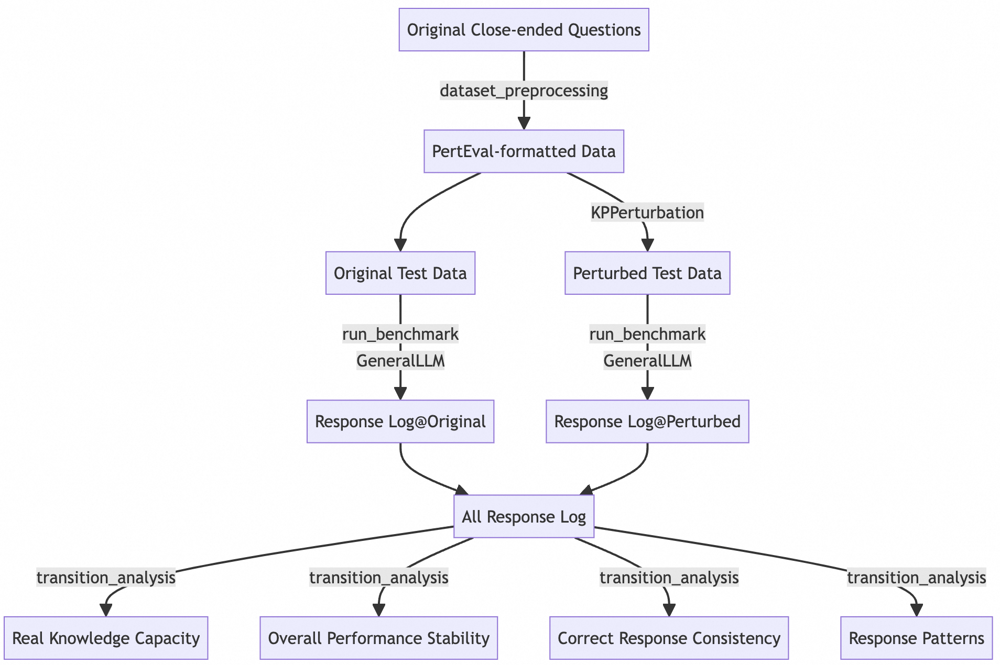

# PertEval: Unveiling Real Knowledge Capacity of LLMs with Knowledge-Invariant Perturbations



## What is PertEval?

PertEval is a toolkit devised for in-depth probing of large language models' (LLMs') knowledge capacity  through **knowledge-invariant perturbations**. **It can be applied to any close-ended benchmark consisting of multiple-choice questions, such as [MMLU](https://github.com/hendrycks/test) and [AGIEval](https://github.com/ruixiangcui/AGIEval).** 

## Evaluation Results of PertEval

### Knowledge Invariance Validation

- **Knowledge invariance scores$\uparrow$ (1-5) rated by human** (4 independent scores presented in ascending order). 

| **Perturbation** | **C-Math**     | **W-History**  | **P-Psychology** | **P-Medicine** |
|------------------|----------------|----------------|------------------|----------------|
| PromptAttack$\uparrow$     | 2.3/2.4/3.0/3.9| 2.2/2.2/2.3/2.8 | 1.3/2.4/2.8/2.8 | 1.6/2.5/3.5/3.6 |
| **PertEval-All (ours)**$\uparrow$   | **3.6/3.8/3.9/3.9** | **3.7/4.1/4.1/4.3** | **4.3/4.4/4.5/4.7**   | **4.2/4.3/4.4/4.6** |

- **Knowledge invariance scores$\uparrow$ (1-5) rated by LLMs**. Values (a/b/c) in each cell denotes the average knowledge invariance score rated by GPT-4-Turbo, Claude-3.5-Sonnet, and LlaMA-3.1-405b, respectively.

| **Perturbation** | **C-Math**     | **W-History**  | **P-Psychology** | **P-Medicine** |
|------------------|----------------|----------------|------------------|----------------|
| PromptAttack$\uparrow$      | 3.2/3.6/3.6 | 3.2/3.3/3.7 | 3.9/3.9/3.7   | 4.1/4.3/4.2 |
| **PertEval-All (ours)**$\uparrow$    | **3.8/3.9/4.0** | **4.0/4.2/4.0** | **4.0/4.4/4.0**  | **4.1/4.4/4.0** |

### LLMs' Knowledge Capacity Evaluation

- ACC@Consist measures the real knowledge capacity of LLMs in PertEval.
- The knowledge capacity measured by ACC@Consist:


| **LLM**         | **C-Math** | **W-History** | **P-Psychology** | **P-Medicine** |
|-----------------|------------|---------------|------------------|----------------|
| gpt-4-turbo     | 0.4700     | 0.5570        | 0.5098           | 0.6838         |
| gpt-3.5-turbo   | 0.0600     | 0.2447        | 0.1944           | 0.2537         |
| glm-3-turbo     | 0.0500     | 0.3249        | 0.1977           | 0.1250         |
| gemini-1.0-pro  | 0.0900     | 0.2911        | 0.2500           | 0.2757         |
| llama-3-8b      | 0.0300           | 0.2236              | 0.1732                 | 0.2463              |
| mistral-7b-v0.2 | 0.0100       |  0.1730             |  0.0915            |  0.0662              |



- Response patterns reveal the cause of the performance decrement of LLMs.
    - **Left**: response patterns of GPT-4 in original data.
    - **Right**: response patterns of GPT-4 in perturbed data.
    - Cause of performance decrement: (1) increasing extra multiple choice ($\Delta = 9.7\%$); (2) increasing wrong single choice ($\Delta = 6.8\%$)











- For more details, please refer to the PertEval paper.


## Try PertEval By Yourself
### Prepare Running Environment
- Install [conda](https://www.anaconda.com/download/) before preparing your PertEval running environment.
- Open your terminal and enter this folder. Then run these commands one by one.
```
conda create -n perteval python=3.10
conda activate perteval
pip install -r requirements.txt
```

### Run PertEval
The workflow of the code of PertEval is presented as follows:



The code of PertEval consists of the following modules:

|File/Path|Description|
|:---|:---|
|[eval_data/xxx](./eval_data/)| It contains evaluation data.
|[log/xxx](./log/)| It contains logs generated by PertEval.
|[run.py](./run.py)| It is the luncher of PertEval. Please refer to `Try PertEval By Yourself` for details about how to run PertEval from scratch.
|[config.json](./config.json)| It is the configuration file of PertEval. It stores settings of atomic perturbations, the definition of the composite perturbation, LLM API Keys, evaluation settings and the setting of LLM-based knowledge-invariance scoring.
|[example.ipynb](./example.ipynb)| It shows examples that use PertEval without run.py and config.json. 
|[GeneralLLM.py](./GeneralLLM.py)|It defines the standard interface for various LLMs, including GPTs, Geminis, GLMs and Qwens, to conveniently conduct evaluation in close-ended benchmarks. You can also implement your own LLM class using the standard interface. Don't forget to register your own LLMs in config.json.|
|[KPPerturbation.py](./KPPerturbation.py)|It defines knowledge-invariant perturbations and the class of multiple-choice questions with standard interfaces. You can also implement your own perturbation strategies using our interface. Don't forget to register your own perturbations in config.json.|
|[dataset_preprocessing.py](./dataset_preprocessing.py)|It defines data formats (.jsonl) for PertEval, and provides MMLU as an example showing how to transform the original data format to the target format.|
|[run_benchmark.py](./run_benchmark.py)|It defines the procedure to evaluate LLMs on close-ended benchmarks.|
|[transition_analysis.py](./transition_analysis.py)|It defines response consistency analysis methods for revealing real knowledge capacities of LLMs.|


In terminal, switch to the perteval environment:
```
conda activate perteval
```

Then run PertEval with run.py:
```
python run.py {parameters}
```

Overall, PertEval consists of four actions - pert, eval, ki_scoring, and analysis. These actions could be selected using the --action parameter of run.py. Details are presented as follows:

|Parameter|Description|
|:---|:---
|--action|The action you want PertEval do. Options: pert - generate the perturbed data; eval - evaluate model knowledge capacity using perturbed and original data; ki_scoring - do llm-based knowledge-invariant scoring; analysis - analyze model knowledge capacity given log paths.; all - do all of actions above one by one.
|--config_path|The path to the PertEval configuration json file. Default - config.json
|--model_for_eval|The name of the model to be evaluated using PertEval, which are available at the api doc page of each LLMs. Currently GPTs, GLMs, Geminis, and Qwens are available. Only required when action = eval or all.
|--source|The file path of the original .jsonl data.
|--target|The file path of the perturbed data. It is also the target path for saving new perturbed_data if action = pert or all.
|--log_save|The prefix of the log path for saving PertEval testing records.
|--log_original|Only required when action = analysis. It is the log path on the original benchmark.
|--log_perturbed|Only required when action = analysis. It is the log path on the perturbed benchmark.

You can also get the parameter description by running `python run.py --help`.

Before running PertEval, please add your llm api keys to config.json.

You could change settings of each action by editing config.json. For instance, you could change the pert.perturbation to define your own composite perturbations. You could also fix the setting of atomic perturbation by editing meta_pert in config.json.

An example for running PertEval (take all actions):
```
python run.py --action all --model_for_eval gpt-3.5-turbo --source eval_data/mmlu_processed/test.jsonl --target eval_data/mmlu_processed/test_pertall.jsonl --log_save log/gpt35turbo-pertall
```

Another example for running PertEval (take the analysis action):
```
python run.py --action analysis --log_original './log/gpt35turbo_original_2024-08-28 17:44:36.483808.jsonl' --log_perturbed './log/gpt35turbo_perturbed_2024-08-28 17:47:02.330564.jsonl'
```

### Reproduce Main Results in PertEval Paper
- Eval logs have been stored in this repo. See ./log/mmlu_test_* .You could run `python run.py --action analysis --log_original {path to the original} --log_perturbed {path to the perturbed}` to obtain main results in the paper.
- For instance, to reproduce main evaluation results of gemini-1.0-pro, run the following command:

```
python run.py --action analysis --log_original './log/mmlu_test_gemini-1.0-pro_hpccp_2024-04-02 11:36:53.789199.jsonl' --log_perturbed 'mmlu_test_gemini-1.0-pro_knowledge_invariant_all_cwpp_2024-05-20 14:42:46.894039.jsonl'
```

### Citation
```bibtex
@article{li2024perteval,
  author       = {Jiatong Li and
                  Renjun Hu and
                  Kunzhe Huang and
                  Yan Zhuang and
                  Qi Liu and
                  Mengxiao Zhu and
                  Xing Shi and
                  Wei Lin},
  title        = {PertEval: Unveiling Real Knowledge Capacity of LLMs with Knowledge-Invariant
                  Perturbations},
  journal      = {CoRR},
  volume       = {abs/2405.19740},
  year         = {2024},
  doi          = {10.48550/ARXIV.2405.19740},
}
```
